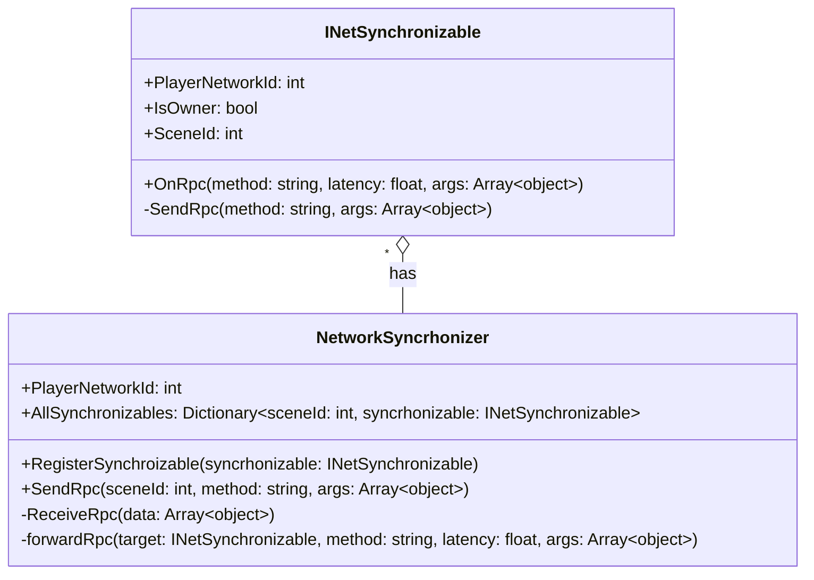
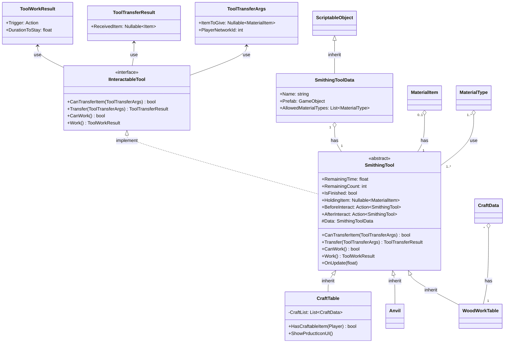
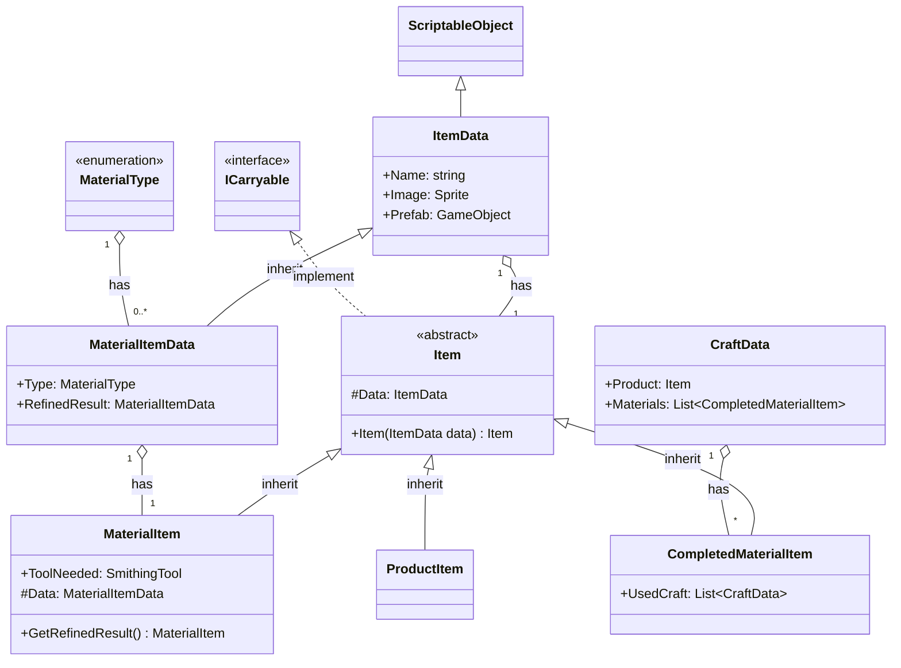

## 도구 Network 클래스

## Tool 클래스

#### 외부 인터페이스
**플레이어가 도구와 아이템 이동을 할 때**
1.  플레이어가 도구에 넘겨주는 정보 : ToolTransferArgs  
 -ItemToGive: 플레이어가 현재 손에 들고 있는 재료 아이템 (반드시 재료 아이템일 경우만 가능)
- PlayerNetworkId: 네트워크에서 플레이어를 식별할 수 있는 값 PhotonViewId등 
2. 도구에서 플레이어에게 넘겨주는 정보: ToolTransferResult
- ReceivedItem: 도구에서 작업된 아이템을 플레이어가 받게 되었을 경우 해당 아이템, 아무 아이템도 받지 못한 경우 null

**플레이어가 도구에서 작업을 할 때**
- 플레이어의 손에 아무 아이템이 없을 때만 가능
- Trigger: 실제 인터렉션이 일어나는 순간 실행해야 하는 이벤트 만약 즉시 일어나는 경우에는 Interact 후에 즉시 실행
(플레이어의 망치가 모루를 때리는 순간,  플레이어가 가지고 있는 칼날을 담금질 기름에 담그는 순간 등)
- DurationToStay: 상호작용시 플레이어 컨트롤이 중지되고 애니메이션을 재생하는 등의 시간 (초)

####  다이어그램

## 아이템 클래스 다이어그램 (참고)

