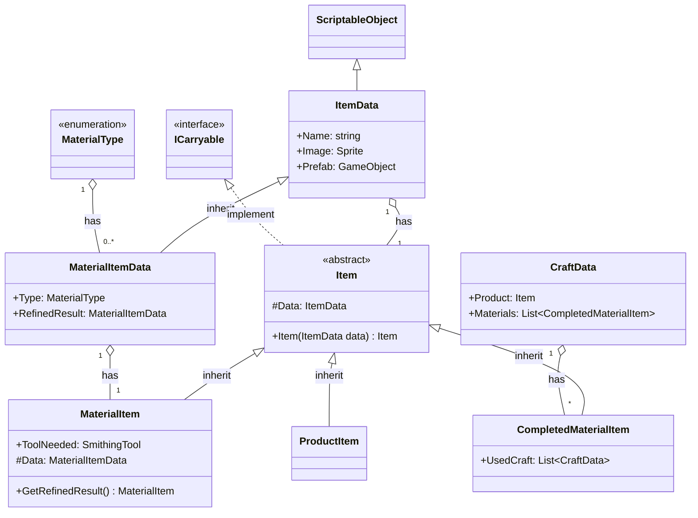
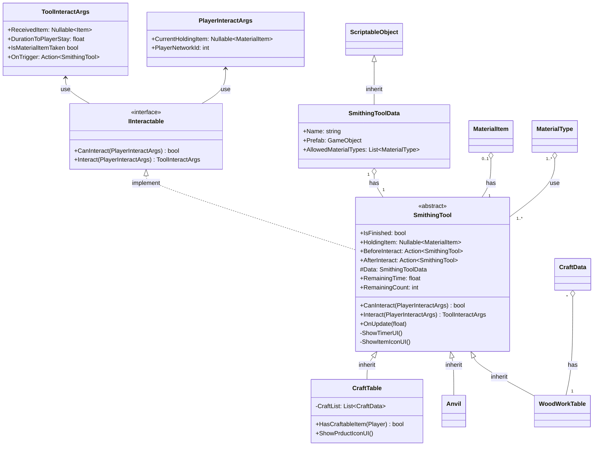

## 아이템 클래스 다이어그램

## Tool 클래스

#### 외부 인터페이스
**플레이어가 도구와 상호작용 할 때**
1.  플레이어가 도구에 넘겨주는 정보 : PlayerInteractArgs  
 - CurrentHoldingItem: 플레이어가 현재 손에 들고 있는 재료 아이템 
            반드시 재료 아이템일 경우만 상호 작용 가능
- PlayerNetworkId: 네트워크에서 플레이어를 식별할 수 있는 값 PhotonViewId등 
- OnTrigger: 실제 인터렉션이 일어나는 순간 실행되는 이벤트 만약 즉시 일어나는 경우에는 Interact 후에 즉시 실행
(플레이어의 망치가 모루를 때리는 순간,  플레이어가 가지고 있는 칼날을 담금질 기름에 담그는 순간 등)
2. 도구에서 플레이어에게 넘겨주는 정보: ToolInteractArgs
- ReceivedItem: 도구에서 작업된 아이템을 플레이어가 받게 되었을 경우 해당 아이템, 아무 아이템도 받지 못한 경우 null
- DurationToPlayerStay: 상호작용시 플레이어 컨트롤이 중지되고 애니메이션을 재생하는 등의 시간 (초)
- IsMaterialItemTaken: 플레이어가 들고 있던 아이템이 도구로 이동되었는지 여부
만약 true인 경우 플레이어가 아이템의 reference를 해제하여 소유권을 해제해야 함

####  다이어그램

