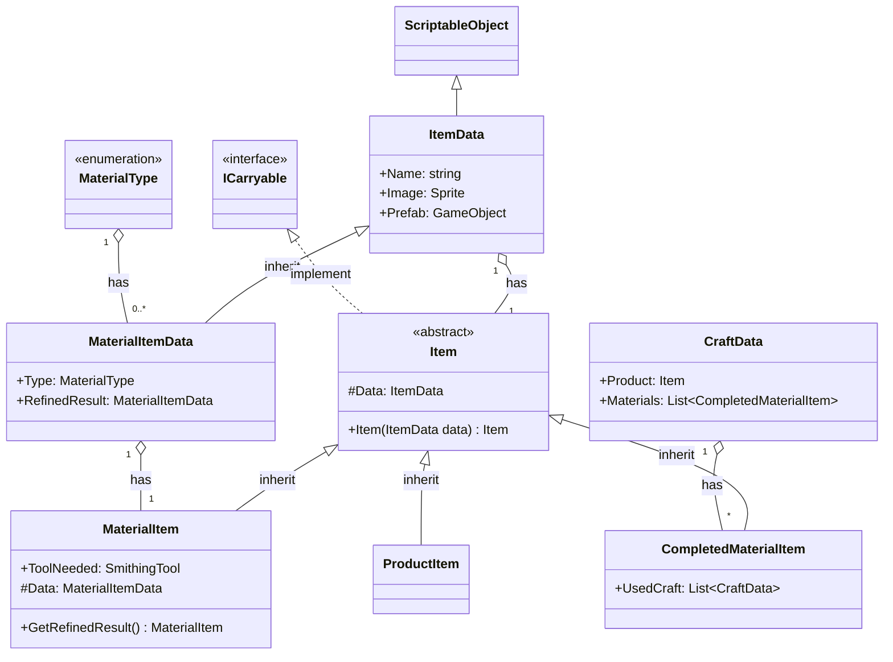
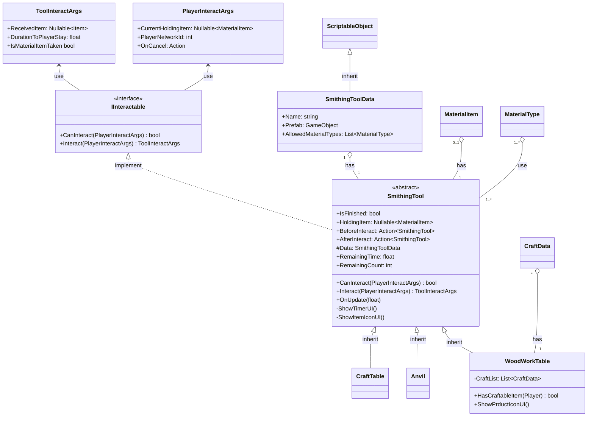

## 아이템 클래스 다이어그램

```mermaid
classDiagram
	class Item {
    	<<abstract>>
        #Data: ItemData
		+Item(ItemData data) Item
	}

	class ItemData {
		+Name: string
		+Image: Sprite
		+Prefab: GameObject
	}

	class ICarryable {
    	<<interface>>
	}
    
    class MaterialItem {
        +ToolNeeded: SmithingTool 
        +GetRefinedResult() MaterialItem 
        #Data: MaterialItemData
    }

    class MaterialItemData {
        +Type: MaterialType
        +RefinedResult: MaterialItemData
    }

    class MaterialType {
        <<enumeration>>
    }

    class CompletedMaterialItem {
        +UsedCraft: List~CraftData~
    }
    
    class CraftData {
        +Product: Item 
        +Materials: List~CompletedMaterialItem~ 
    }

    class ProductItem {

    }

	ItemData "1" o-- "1" Item: has
    ScriptableObject <|-- ItemData
    Item <|-- MaterialItem: inherit
    ItemData <|-- MaterialItemData: inherit
    MaterialItemData "1" o-- "1" MaterialItem: has
    MaterialType "1" o-- "0..*" MaterialItemData: has
    Item <|-- CompletedMaterialItem: inherit
    Item <|-- ProductItem : inherit
    CraftData "1" o-- "*" CompletedMaterialItem: has
    ICarryable <|.. Item: implement
```

## Tool 클래스 다이어그램

```mermaid
classDiagram

    class PlayerInteractArgs {
        +CurrentHoldingItem: Nullable~MaterialItem~
        +PlayerNetworkId: int
        +OnCancel: Action
    }

    class ToolInteractArgs {
        +ReceivedItem: Nullable~Item~
        +DurationToPlayerStay: float
        +IsMaterialItemTaken bool
    }

    class SmithingToolData {
        +Name: string
        +Prefab: GameObject
        +AllowedMaterialTypes: List~MaterialType~
    }

	class SmithingTool {
    	<<abstract>>
        +IsFinished: bool 
        +HoldingItem: Nullable~MaterialItem~  
        +BeforeInteract: Action~SmithingTool~
        +AfterInteract: Action~SmithingTool~
        #Data: SmithingToolData
        +CanInteract(PlayerInteractArgs) bool
        +Interact(PlayerInteractArgs) ToolInteractArgs
        +OnUpdate(float)
        +RemainingTime: float 
        +RemainingCount: int
        -ShowTimerUI()
        -ShowItemIconUI()
	}

    class IInteractable {
        <<interface>>
        +CanInteract(PlayerInteractArgs) bool
        +Interact(PlayerInteractArgs) ToolInteractArgs
    }

    class WoodWorkTable {
        +HasCraftableItem(Player) bool
        +ShowPrductIconUI()
        -CraftList: List~CraftData~
    }

    class Anvil {

    }

    class CraftTable {
        
    }
    
    ScriptableObject <|-- SmithingToolData: inherit
    SmithingToolData "1" o-- "1" SmithingTool: has
    IInteractable <|.. SmithingTool: implement
    PlayerInteractArgs <-- IInteractable: use
    ToolInteractArgs <-- IInteractable: use
    MaterialItem "0..1" o-- "1" SmithingTool: has
    MaterialType "1..*" o-- "1..*" SmithingTool: use
    SmithingTool <|-- WoodWorkTable: inherit
    SmithingTool <|-- Anvil: inherit 
    SmithingTool <|-- CraftTable: inherit
    CraftData "*" o-- "1" WoodWorkTable: has
```
